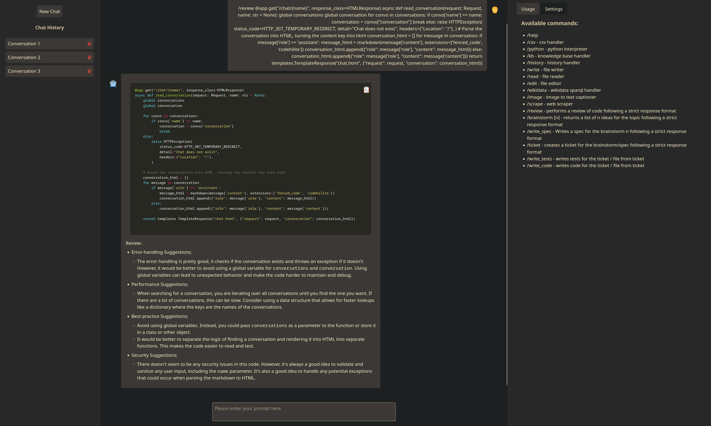

# FastAPI / HTMX Chatbot

## Table of Contents

- [Description](#description)
- [Functions](#functions)
- [Usage](#usage)
- [Screenshots](#screenshots)

## Description

FastAPI/HTMX Chatbot, for deploying to [Deta Space](https://deta.space/)

* Requires usage of /commands to save on tokens from system messages and function params. /commands send the message to different agents based on the command with their specific system message and function params.
* The UI is regular HTML but with HTMX for the dynamic parts.
* Has both OpenAI and Anthropic models available

## TODO
- [ x ] Add database for users and history (works on deta.space)
- [ ] Add user auth
- [ ] Add user preferences (api-keys, system messages, etc)

## Functions

* /csv - csv handler
* /python - python interpreter
* /write - file writer chooses between `data/`, `data/code/` and `data/code/projects` depending on what it's asked to write
* /read - file reader
* /edit - file editor (takes line range, text)
* /wikidata - wikidata sparql handler
* /scrape - web scraper 
* /claude - Use anthropics model (100k token window)

### Coding Assistant commands

These are not functions per se, they run a model with a specific system message for each that returns a response in a strict format. See `system.py` for the system messages. Also, screenshots.

* /review - performs a review of the code following a strict response format
* /brainstorm [n] - returns a list of n ideas for the topic following a strict response format
* /write_spec - Writes a spec for the brainstorm following a strict response format
* /ticket - creates a ticket for the brainstorm/spec following a strict response format
* /write_tests - writes tests for the ticket / file from ticket
* /write_code - writes code for a file from ticket
* /write_files - writes all the files/subfolders from the ticket/spec into the projects folder.

Example Usecase: /read_file code.ts/py/rs/etc -> /review -> /edit_file code.ts/py/rs/etc

## Usage

### Only local:

* Create a .env file in the root of the project:
  - OPENAI_API_KEY=your-api-key
  - ANTHROPIC_API_KEY=your-api-key
* `pip install -r requirements.txt` to install dependencies
* `python main.py` to run the chatbot

#### Deta.space

[Read the docs](https://deta.space/docs/en)

## Screenshots

### Chat UI
